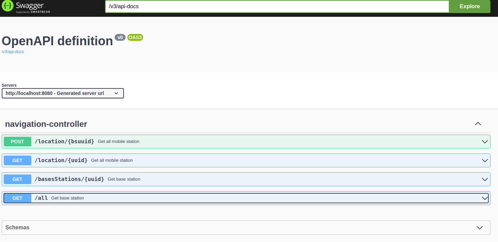
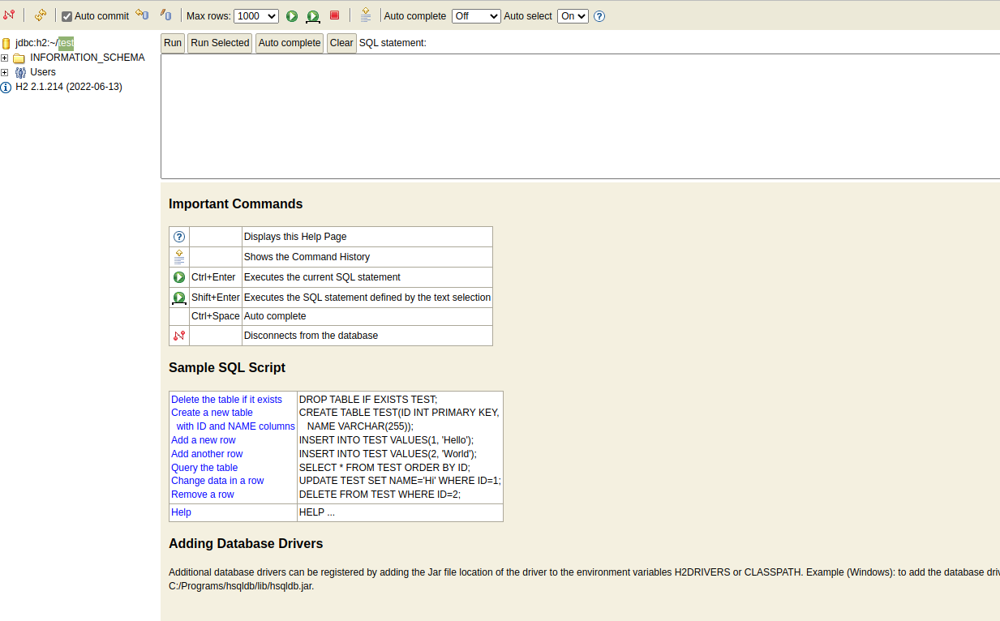

# wemakesoftware

## Assumptions
* mobile station do not report locations
* they report id and timestamp to base station and the location of th base station is made mobile station location
* base stations have initial location set to them
* mobile station can report to many base station at different time, but they are always under one for their latest location

### Links

* [SWAGGER](http://localhost:8080/swagger-ui/index.html#/)
* [BASE STATION LOCATIONS](http://localhost:8080/public/index.html) 
* [PUBLIC PAGE](http://localhost:8080/public/index.html) 
* [H2DATABASE](http://localhost:8080/h2-console) 

### screenshot

### Swagger

### h2database

### Bas station matrix

